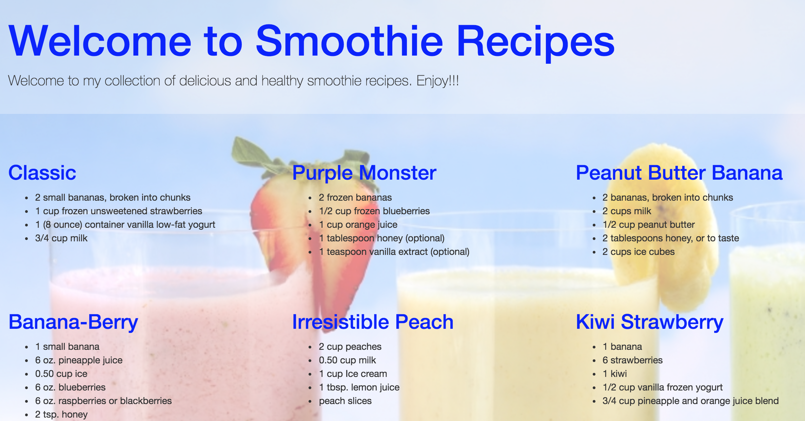

# Smoothie recipes

## Instructions

Clone this repository and test that you can see the Smoothie Recipes in your browser:

```bash
cd ~/ga/wdi
git clone https://github.com/ATL-WDI-Exercises/smoothie-recipes.git
cd smoothie-recipes
open index.html
```

Now use your Text Editor to make changes to the `app.css` file to make your Smoothie Recipes app look _awesome_!

Try some of the following:

* Change the background color or set a background image
* Add some color to the recipes text
* Adjust the size of the headings and other text
* Change the font family to something fun (like _fantasy_)
* Use Flexbox or a grid system (such as Twitter Bootstrap) to put your recipes side-by-side
* Make it responsive

Here is a sample solution:


